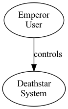
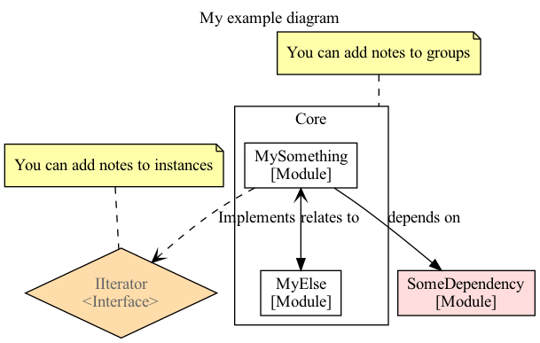

daya: Rapid text-based graphing tool
============================

Example usage of compiler:

    // Generate a png
    daya myfile.daya output.png

    // Generate an svg
    daya myfile.daya output.svg

    // Generate only the intermediary dot
    daya myfile.daya output.dot

daya is a tool and library to convert from the .daya format to regular .dot, .png or .svg.

The daya-format is intended to allow for rapid diagramming from text sources. Mostly relationship-like diagrams such as UML's activity- and component-diagrams etc. There are currently no plan to add features for sequence-diagrams and such.

It can be thought of as "a subset of dot with custom types" (*). "Type" here are, due to the visual nature of it all, more comparable to CSS classes than types from strictly typed programming languages: they provide templates for how different parts shall appear.

The subset of features, attributes and such is highly opiniated, and very much subject to change as we move toward v1.0.

(*): This is also to be read as; There are many, _many_ diagram-situations which are not intended to be solved by daya.

Getting started:
----------------

Prerequisite: have graphviz (https://graphviz.org/download/) installed and dot available in path on your system.

Create a .daya file - e.g "gettingstarted.daya":

    // Create one or more node types
    node User;
    node System;

    // Create one or more edge types
    edge controls;

    // Create instances based on node types
    emperor: User;
    deathstar: System;

    // Create relationships based on instances and edge types
    emperor controls deathstar;

then run: ```daya gettingstarted.daya gettingstarted.png``` to create a diagram and save it as output.png for your viewing pleasures:




Daya advanced format example:
---------------

file: common_types.daya:

    // Define common node-types
    node Interface {
        label="<Interface>";
        shape=diamond;
        fgcolor=#666666;
        bgcolor=#ffddaa;
    }

    node Module {
        label="[Module]";
        shape=box;
        fgcolor=#000000;
        bgcolor=#ffffff;
    }

    // Define edge-/relationship-types
    edge implements {
        label="Implements";
        edge_style=dashed;
        target_symbol=arrow_open;
    }

    edge depends_on; // rely on defaults

    edge relates_to {
        source_symbol=arrow_open;
        target_symbol=arrow_open;
    }

file: mygraph.daya

    // imports the file as described above. Limitation: path can't contain newline
    @common_types.daya

    // Set title of diagram
    label="My example diagram";

    // Declare the module-instances, optionally grouped
    IIterator: Interface {
        note="You can add notes to instances";
    }

    group Core {
        note="You can add notes to groups";

        // Groups are by default label-less (for now)
        label="Core";

        MySomething: Module;
        MyElse: Module;
    }

    SomeDependency: Module {
        // An instantiation can override base-node fields
        bgcolor="#ffdddd";
    }

    // Describe relationships between modules
    MySomething implements IIterator;
    MySomething depends_on SomeDependency;
    MySomething relates_to MyElse {
        // A relationship can override base-edge fields
        target_symbol=arrow_filled;
    }


Result:



Daya grammar
-----------
Types of statements:

* Declare a node-type:

        // Using only default properties
        node NodeType;

        // or override particular properties
        node OtherNodeType {
            label="Custom label";
            shape=diamond;
        }

* Declare an edge-type

        // Using only default properties - a simple, one-directional arrow when used in a relationship
        edge owns;

        // or override particular properties - to render e.g a two-way arrow
        edge twowaydataflow {
            source_symbol=arrow_filled;
            target_symbol=arrow_filled;
        }

* Create a specific instance of a node

        // Will inherit the properties of the given node type
        myinstance: NodeType;

        // And optionally override particular ones for this given instance
        otherinstance: OtherNodeType {
            shape=circle;
        }

* Specify a relationship between two node-instances using an edge

        // Using the default style of the particular edge
        myinstance owns otherinstance;

        // Or override particular properties for the edge used in this given relationship
        otherinstance twowaydataflow myinstance {
            label="Overridden label for edge";
        }

For the different types there are a set of allowed parameters that can be specificed:

* For node or instance:
    * label: string - supports in-file newlines or \n
    * bgcolor: string/#rrggbb, forwarded directly to dot.
    * fgcolor: see bgcolor.
    * shape: string, forwarded directly to dot: https://graphviz.org/doc/info/shapes.html
* for edge or relationship:
    * label: string
    * source_symbol: none|arrow_filled|arrow_closed|arrow_open. default: none
    * target_symbol: see source_symbol. default: arrow_open
    * edge_style: solid|dotted|dashed|bold. default: solid
* An instance automatically inherits the parameters of their node-type. The labels are concatinated with a newline, the remaining fields are overridden.
* If no label is specified, the name is used
* The parameters of an edge can be overridden pr relationship-entry

Installation
-----------
See releases in repo, or Build-section below.

To install a release, download the platform-appropriate archive, decompress it, and put the resident daya-binary somewhere in your path.

Build
-----------

Development is done using quite recent zig 0.10.x builds.

Build and run (from /compiler):

    $ zig build run -- --help

or (e.g.) for installation on Unix-like systems (from /compiler):

    $ zig build -Drelease-safe --prefix /usr/local

Run tests for libdaya (from /libdaya):

    $ zig build test


Components / inner workings
-----------

The system is split into the following components:
* Compiler library (/libdaya) - the core compiler, can be linked into e.g compiler exe, web service, and possibly in the end as WASM to make the web frontend standalone.
* Compiler executable (/compiler)
* Web service (not started)
* Web frontend (not started)

### Compiler

The main logic of the daya-compiler is organized as a library located under /libdaya. Then there's a simple executable-wrapper located under /compiler.

#### libdaya

The core component of it all. Provides functionaly to parse .daya, validate the results, output valid .dot + eventually directly execute system-installed dot to generate a graphical representation of the diagram.

### Service / backend

Two parts:
1. An endpoint which takes daya and returns dot, PNG or SVG.
1. Provider of the static frontend

### Frontend

Minimal, single-page, input-form to provide daya data and desired output-format (dot, png, svg).


### Web component for easy inclusion into sites

...

Design goals
---------
* Overall:
    * Value rapidness and sensical defaults over exact control
* Internals:
    * Reproducible builds - as far as possible, ie.: up until dot
    * If the compiler hasn't complained, then dot shall succeed. ie.: if the compiler hasn't detected an error, then the intermediary dot-data shall be valid.

TODO
---------
* Integrate dot / libdot statically linked
    * including libs for png and svg?
* Ensure all include-paths are relative to the containing file.
* Currently a lot of the defaults is handled within dot.zig - this is error-prone if we were to change graphing-backend
* Support lifting notes to top level of generated doc? E.g. now, if added to an instance wihtin a group, the note also gets rendered within the same group
* Support multiple files as input (glob?) + a parameter to specify output-format, which will reuse the respective input-names with added extension for output
* Design and implement scoping strategy
* Support monitor/auto-build?
* .daya
    * TBD: Implement more advanced (composed) shapes? E.g. an UML-like class with sections?
    * Include-functionality:
      * Need to explore specific use cases to determine full functionality set here. Leaves as-is for now (in-place + common global scope).
      * Reconsider scoping to avoid unwanted collisions between subdiagrams + but still accommodate convenient definition-reuse.
    * Explicitly define behaviour wrt duplicate definitions; shall the latter be invalid behaviour, or shall they be fused? Either simply adding children, or explicitly checking for type and override values.
    * Simplify syntax: allow } as EOS. Don't require quotes around #-colors. Consider removing ; alltogether. Nl can serve the same purpose.
* Finish v1 daya-syntax: what is scope?
    * Ensure compilator supports entire daya-syntax
* Lower importance:
    * Implement web service
    * Implement frontend
* Nice-to-haves:
    * Accept a list of "instantiations" to only render whatever relates to them. Accept "degrees of separation" as well?
    * Support "playback"-functionality? Render node-by-node as they are instantiated, ordered by source?
    * Mode to allow anonymous types? E.g. don't require predefined nodes/edges, more simular to how dot behaves.
    * Allow edges to specify valid source/target-node types?


Attributions
============
* graphviz - daya currently uses graphviz/dot as the low level graph tool
