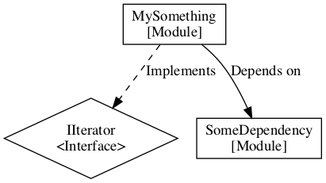

hidot: Rapid text-based graphing tool
============================

Example usage of compiler:

    hidot myfile.hidot output.dot
    hidot myfile.hidot output.png
    hidot myfile.hidot output.svg

hidot is a tool and library to convert from the hidot format to regular .dot, .png og .svg.

The hidot-format is intended to allow for rapid graphing from text sources, with 

It can be thought of as "(a subset of) dot with custom types".

Hidot format example:
---------------

    // Define node-types
    node Interface {
        label: "<Interface>"
        shape: diamond
        color: #000000
        background: #ffffff
    }

    node Module {
        label: "[Module]"
        shape: box
        color: #000000
        background: #ffffff
    }

    // Define edge/relationship-types
    edge implements {
        label: "Implements"
        style: dashed
        targetSymbol: arrow_open
    }

    edge depends_on {
        label: "Depends on"
        style: solid
        targetSymbol: arrow_open
    }

    // Declare the module-instances
    IIterator: Interface
    MySomething: Module
    SomeDependency: Module

    // Describe relationships between modules
    MySomething implements IIterator
    MySomething depends_on SomeDependency

Result:

* TODO: Update example .hidot and .png as we move on

Components
-----------

The system is split into the following components:
* Compiler library (/libhidot) - the core compiler, can be linked into e.g compiler exe, web service, and possibly in the end as WASM to make the frontend standalone.
* Compiler executable (/compiler)
* Web service
* Web frontend

### Compiler

...

### Service / backend

Two parts:
1. An endpoint which takes hidot and returns dot, PNG or SVG.
1. Serve the static frontend

### Frontend

Minimal, single-page, input-form to provide hidot data and desired output-format (dot, png, svg).

### Web component for easy inclusion into sites

TODO
---------
* Integrate dot / libdot
  * including libs for png and svg?
* .hidot
  * Support colors - simply passthrough colors to dot: https://graphviz.org/docs/attr-types/color/ . No need to convert
  * Add top-level layout{} for e.g. background, padding, layout-engine, ...
  * Support groups
  * TBD: Define styles ala CSS-classes, which then can be applied to the individual types?
  * ...
* Finish v1 hidot-syntax
* Ensure compilator supports entire hidot-syntax
* Implement web service
* Implement frontend

Attributions
============
* graphviz - hidot currently uses graphviz/dot as the low level graph tool